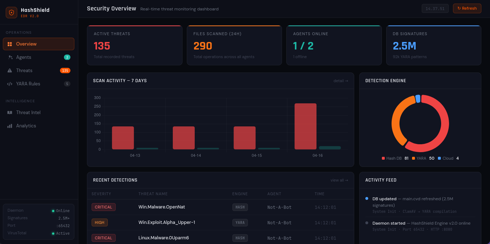
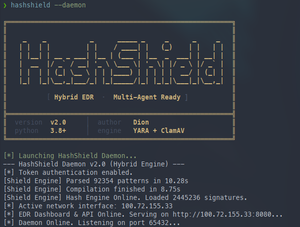
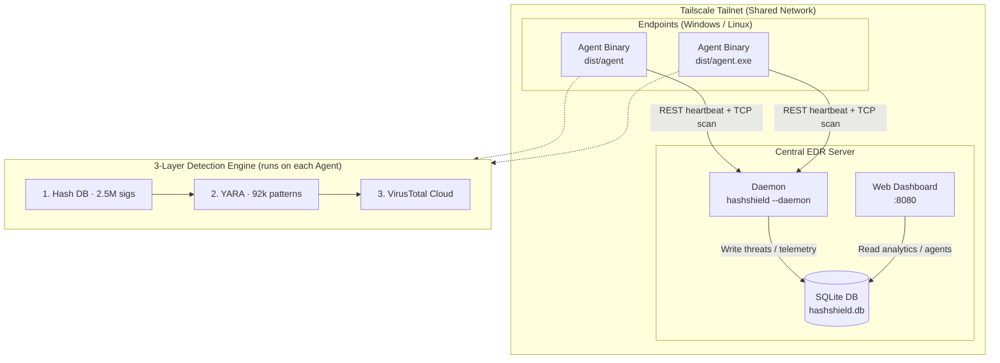

# HashShield EDR

[](https://github.com/VelkaRepo/HashShield/actions)
[](https://opensource.org/licenses/MIT)
[](https://www.python.org/downloads/)
[](https://tailscale.com/)
[](https://www.linux.org/)
[](https://www.microsoft.com/)


**HashShield EDR v2.0** is a professional-grade **Endpoint Detection and Response (EDR)** system and **hybrid antivirus engine** written in Python. Built with a centralized **Client-Server Architecture** over **Tailscale VPN**, it combines instant local detection—powered by **2.5M+ ClamAV signatures** and **92k+ YARA heuristic patterns**—with cloud-based analysis via VirusTotal, providing enterprise-level scanning and central threat management from a single dashboard.

> 📌 This project is developed as an undergraduate thesis (*Skripsi*) by **Dion**.

---

## 📖 Table of Contents

- [Screenshots](#-screenshots)
- [Key Features](#-key-features)
- [Architecture](#%EF%B8%8F-architecture)
- [Project Structure](#-project-structure)
- [Prerequisites](#-prerequisites)
- [Installation](#-installation)
- [Configuration](#-configuration)
- [Quick Start](#-quick-start)
- [Agent CLI Reference](#-agent-cli-reference)
- [Detection Engine](#-detection-engine)
- [Reporting](#-reporting)
- [FAQ](#-faq)
- [License](#-license)

---

## 📸 Screenshots

### EDR Dashboard

> Real-time Security Overview: active threats, 7-day scan activity chart, detection engine breakdown (Hash DB / YARA / Cloud), and recent detections with severity labels.

### Daemon Startup

> Daemon boot sequence: token auth enabled, 92k YARA patterns compiled, 2.5M hash signatures loaded, HTTP dashboard and TCP socket online.

### Executive HTML Report
> Sample report generated by the agent using the `-o` flag. Includes severity breakdown, detection method chart, and a full sortable threat table.

[📄 View Sample Report](https://velkarepo.github.io/HashShield/img/reports-preview.html)

---

## 🚀 Key Features

- **Enterprise EDR Dashboard** — Web-based Security Operations Center (SOC) UI served at `http://<SERVER_IP>:8080`. Displays live threat counts, 7-day scan activity, agent status, and detection engine breakdowns.
- **Multi-Agent Support** — Deploy pre-compiled agent binaries across Windows and Linux endpoints with no Python required. Agents communicate via REST API (heartbeat) and TCP socket (scan results).
- **Tailscale-Powered Networking** — All agents and the central server operate within a private Tailscale tailnet, enabling secure cross-network communication without port forwarding or VPN configuration.
- **3-Layer Hybrid Detection Engine** — Sequential analysis using Hash DB → YARA Heuristics → VirusTotal Cloud, maximizing detection coverage while minimizing false positives.
- **2.5M+ Signature Database** — Uses a ClamAV-compatible `main.cvd` signature file, compiled at startup for fast hash lookups.
- **92k YARA Heuristic Patterns** — Custom `rules.yara` compiled into the engine, detecting obfuscated malware, packers, and behavioral patterns.
- **Token Authentication** — Agents authenticate to the daemon via a configurable shared token, preventing unauthorized scan submissions.
- **Data Persistence** — SQLite database (`hashshield.db`) stores all scan history, threat records, agent states, and telemetry across restarts.
- **Executive HTML Reports** — Agents generate polished, standalone HTML reports with sortable threat tables, severity charts, and per-file scan results.
- **Pre-compiled Binaries** — `dist/agent` (Linux) and `dist/agent.exe` (Windows) for deployment on endpoints without a Python environment.

---

## 🏗️ Architecture

HashShield separates the **Central Server** from **Remote Endpoints**, connected over a private **Tailscale tailnet**:



---

## ✅ Prerequisites

**Central Server (where the daemon runs):**
- Python **3.8+** with `pip` and `venv`
- [Tailscale](https://tailscale.com/) installed and connected to your tailnet
- A **VirusTotal API key** (free tier works) — [get one here](https://www.virustotal.com/gui/join-community)

**Endpoints (where agents run):**
- [Tailscale](https://tailscale.com/) installed and connected to the **same tailnet** as the server
- No Python required — agents run as pre-compiled binaries from `dist/`

---

## 📦 Installation

> ⚠️ Run these steps on the **central server machine only**. Endpoints use pre-compiled binaries — see [Quick Start](#-quick-start).

**1. Clone the repository**

```bash
git clone https://github.com/VelkaRepo/HashShield.git
cd HashShield
```

**2. Create and activate a virtual environment**

```bash
python3 -m venv .venv

# Linux / macOS
source .venv/bin/activate

# Windows (PowerShell)
.\.venv\Scripts\Activate.ps1
```

**3. Install dependencies and register the CLI**

```bash
pip install -r requirements.txt
pip install -e .
```

> `pip install -e .` is **required**. It registers the `hashshield` command to your system — without it, running `hashshield --daemon` will return `command not found`.

---

## ⚙️ Configuration

Create a `.env` file inside the `src/` directory:

```env
# src/.env

VIRUSTOTAL_API_KEY="YOUR_VIRUSTOTAL_API_KEY"

SHIELD_DAEMON_PORT=65432
SHIELD_HTTP_PORT=8080
SHIELD_LOCAL_IP="100.x.x.x"       # Your Tailscale IP — find it with: tailscale ip -4

AUTH_TOKEN="your_secret_token"
```

| Variable | Description | Default |
|---|---|---|
| `VIRUSTOTAL_API_KEY` | VirusTotal API key for cloud lookups | *(required)* |
| `SHIELD_DAEMON_PORT` | TCP port for agent-to-daemon communication | `65432` |
| `SHIELD_HTTP_PORT` | HTTP port for the web dashboard | `8080` |
| `SHIELD_LOCAL_IP` | Daemon's Tailscale IP (`100.x.x.x`) | *(required)* |
| `AUTH_TOKEN` | Shared secret for agent authentication | *(required)* |

> 💡 **Tailscale IP Tip:** Run `tailscale ip -4` on the server machine to get the correct `100.x.x.x` address to use as `SHIELD_LOCAL_IP`.

---

## ⚡ Quick Start

### 1. Start the Central EDR Daemon (Server Machine)

Run this on your **server**. It loads the detection engine, opens the TCP listener, and serves the web dashboard.

```bash
hashshield --daemon
```

Expected output:
```
[*] Launching HashShield Daemon...
[*] Token authentication enabled.
[Shield Engine] Parsed 92354 patterns in 7.79s
[Shield Engine] Hash Engine Online. Loaded 2445236 signatures.
[*] EDR Dashboard & API Online. Serving on http://100.x.x.x:8080...
[*] Daemon Online. Listening on port 65432...
```

Access the dashboard at: **`http://<TAILSCALE_IP>:8080`**

---

### 2. Deploy the Agent on an Endpoint

Copy the appropriate binary from `dist/` to the **target machine**. The endpoint does **not** need Python installed.

**Linux endpoint:**
```bash
./agent /path/to/scan -o report.html
```

**Windows endpoint:**
```cmd
agent.exe C:\path\to\scan -o report.html
```

> **Windows (first time):** Run `install.bat` as Administrator before executing the agent.

The agent will automatically authenticate to the daemon via Tailscale, run the 3-layer scan, push results to the dashboard, and save the report locally if `-o` is specified.

---

## 🖥️ Agent CLI Reference

```
usage: hashshield-agent [-h] [--server IP] [--port PORT] [--token TOKEN]
                        [-o FILE] [--format FORMAT]
                        PATH
```

| Argument | Description | Default |
|---|---|---|
| `PATH` | File or directory to scan | *(required)* |
| `--server IP` | Daemon Tailscale IP | from `.env` |
| `--port PORT` | Daemon TCP port | `65432` |
| `--token TOKEN` | Auth token (overrides `.env`) | from `.env` |
| `-o FILE` | Save report to file | *(none)* |
| `--format FORMAT` | Report output format | `html` |
| `-h, --help` | Show help message | — |

---

## 🔍 Detection Engine

HashShield uses a **sequential 3-layer detection pipeline** per scanned file:

| Layer | Method | Source | Speed |
|---|---|---|---|
| **1. Hash DB** | SHA256 / MD5 lookup | `src/main.cvd` — 2.5M ClamAV signatures | ⚡ Fastest |
| **2. YARA Heuristics** | Pattern & behavioral matching | `rules.yara` — 92k+ patterns | 🔶 Medium |
| **3. Cloud Intelligence** | API hash reputation lookup | VirusTotal | 🌐 Slowest |

A file stops at the first layer that produces a detection. The dashboard's **Detection Engine** donut chart shows the live distribution of detections across all three layers.

---

## 📊 Reporting

The `-o` flag generates a standalone **Executive HTML Report** on the endpoint. No internet connection is needed to view it.

The report includes:

- **Summary metrics** — total files scanned, threats detected, clean files, scan duration
- **Severity breakdown chart** — CRITICAL / HIGH / MEDIUM / INFO
- **Detection method chart** — Hash DB vs YARA vs Cloud
- **Full threat table** — sortable by severity, threat name, detection engine, and file path
- **Print-ready layout** — clean A4 PDF export via browser print dialog (`Ctrl+P`)

---

## ❓ FAQ

**Q: Agent says `connection refused` or can't reach the daemon.**  
A: Make sure both the server and the endpoint are connected to the same Tailscale tailnet (`tailscale status`). Also verify `SHIELD_LOCAL_IP` in `.env` matches the server's Tailscale IP (`tailscale ip -4`).

**Q: Running `hashshield --daemon` returns `command not found`.**  
A: You skipped `pip install -e .` during installation. Run it from the project root with your virtual environment active.

**Q: YARA compilation takes a long time on startup.**  
A: This is expected. Compiling 92k+ patterns typically takes 7–10 seconds on first load. Subsequent startups use a compiled cache.

**Q: VirusTotal isn't returning results / scan is slow.**  
A: The free VirusTotal API tier is limited to **4 requests/minute**. Large scans will be rate-limited automatically. Check that `VIRUSTOTAL_API_KEY` is set correctly in `src/.env`.

**Q: The dashboard shows an agent as Offline.**  
A: The agent sends heartbeats only while a scan is running. An agent that has finished scanning or crashed will appear offline. Rerun the agent to reconnect.

**Q: Can I run the agent without a daemon running?**  
A: No. The agent requires the daemon for token authentication and scan result storage. Start the daemon first with `hashshield --daemon`.

**Q: Can I add more YARA rules?**  
A: Yes — add your `.yara` rules to `rules.yara` and restart the daemon. New patterns will be compiled into the engine on next startup.

---

## 📜 License

This project is licensed under the **MIT License** — see the [LICENSE](./LICENSE) file for details.