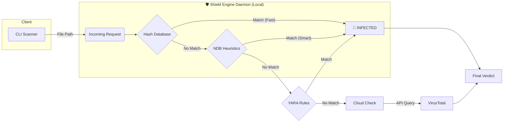

# HashShield

[](https://github.com/VelkaRepo/HashShield/actions)
[](https://opensource.org/licenses/MIT)
[](https://www.python.org/downloads/)
[](https://www.linux.org/)
[](https://www.microsoft.com/)
[](https://github.com/VelkaRepo/HashShield/releases/latest)


**HashShield** is a professional-grade **hybrid antivirus engine** written in Python. It utilizes a **Client-Server Architecture** to combine instant local detection—powered by **2.5 million+ signatures** and **over 92,000 advanced heuristic patterns**—with cloud-based analysis (VirusTotal), providing enterprise-level scanning capabilities.

---

## 📖 Table of Contents

- [Key Features](#-key-features)
- [Architecture](#%EF%B8%8F-architecture)
- [Installation](#-installation)
- [Quick Start](#-quick-start)
- [Documentation](#-documentation)

---

## 🚀 Key Features

- **Hybrid Engine:** Combines Local Signatures (2.5M+), Heuristics (NDB/YARA), and Cloud Intelligence (VirusTotal).
- **Daemon Architecture:** Background service for **O(1) Instant Scanning**.
- **Archive Scanning:** Recursively scans inside `.zip`, `.tar`, and `.tar.gz` files.
- **Professional Reporting:** Exports audit logs to **HTML, TXT, CSV, and JSON**.
- **Resilience:** Auto-healing database updates and offline fallback modes.

---

## 🏗️ Architecture

HashShield separates the **Scanner (Client)** from the **Engine (Server)**:



## 📦 Installation

1.  **Clone & Setup Environment**
     ```bash
     git clone [https://github.com/VelkaRepo/HashShield.git](https://github.com/VelkaRepo/HashShield.git)
     cd HashShield
     
     # Linux / Mac
     python3 -m venv .venv
     source .venv/bin/activate
     
     # Windows (PowerShell)
     python -m venv .venv
     .\.venv\Scripts\Activate.ps1
     
     # Install Dependencies
     pip install -r requirements.txt
     ```

2. **Install Global Command**
   ```bash
   pip install -e .
   ```

3. **Database Setup**
   The engine will attempt to download the database automatically upon first launch.
   
   *Manual Option:* Download `main.cvd` from [Releases](https://github.com/VelkaRepo/HashShield/releases) and place in `src/`.

4. **Configuration**
   Create `src/.env` with your API key:
   ```env
   VIRUSTOTAL_API_KEY="YOUR_KEY"
   SHIELD_DAEMON_PORT=65432
   ```

---

## ⚡ Quick Start

**1. Start the Engine (Daemon)**
```bash
hashshield --daemon
```

**2. Scan a Directory**
```bash
hashshield .
```
> **Note:** The scan command will automatically start the daemon if it's not already running. No need to manually start it with `--daemon` unless you want to run it in a separate terminal.

> **Stopping the Daemon:**
> - **Linux/macOS:** `pkill -f "hashshield --daemon"`
> - **Windows:** 
>   ```cmd
>   taskkill /F /IM python.exe /FI "WINDOWTITLE eq hashshield"
>   ```
>   or use Task Manager to end the Python process named "hashshield"


---

## 📚 Documentation

For advanced usage, including **Archive Scanning**, **Reporting**, and **Automation**, please consult the **User Guide**:

👉 **[Read the Full Usage Guide (USAGE.md)](./USAGE.md)**