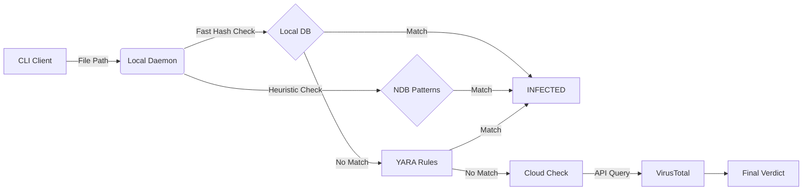

# HashShield

[](https://opensource.org/licenses/MIT)
[](https://www.python.org/downloads/)
[](https://github.com/VelkaRepo/HashShield/releases/latest)


**HashShield** is a **hybrid antivirus engine** written in Python that utilizes a **Client-Server Architecture** to combine instant local detection (Hash + Heuristics) with cloud-powered analysis (VirusTotal), providing enterprise-level scanning capabilities on Linux and Windows systems.

## Key Features

- **Hybrid Scanning Engine**
  A multi-layered defense pipeline:
  1. **Shield Engine (Local):** Instant O(1) detection using 2.5M+ signatures.
  2. **Heuristic Engine (Local):** Uses Normalized Database (.ndb) patterns to detect malware variants even if the hash changes.
  3. **YARA Rules (Local):** Pattern matching for specific threat behaviors (e.g., Meterpreter payloads).
  4. **Cloud Intelligence (API):** Fallback to VirusTotal for unknown "Zero-Day" threats.

- **High-Performance Daemon**
  Runs a background service (`hashshield --daemon`) that keeps the signature database loaded in RAM, allowing for **instant scanning** without reloading the DB for every file.

- **Smart Rate Limiting**
  Includes a `--threads` option to respect API quotas or maximize speed (`asyncio` concurrency).

- **Resilience & Offline Mode**
  Works fully offline using the local engine. Automatically upgrades to cloud scanning when an internet connection is available.

- **Custom Extensibility**
  Supports custom `.hdb` (Hash) and `.ndb` (Hex Pattern) databases—simply drop them in the `src/` folder.

- **Interactive Response**
  Prompts user for action (Quarantine/Delete/Ignore) upon detection.

## Architecture

HashShield separates the **Scanner (Client)** from the **Engine (Server)** to maximize performance:



## Requirements

- Python **3.8+**
- A [VirusTotal API key](https://www.virustotal.com/gui/join-us) (Free for personal use)
- **RAM:** ~500MB (for the Daemon to hold signatures in memory)

## Installation & Setup

### 1. Clone & Environment

```bash
git clone https://github.com/VelkaRepo/HashShield.git
cd HashShield

# Create Virtual Environment (Recommended)
python3 -m venv .venv
source .venv/bin/activate  # On Linux/Mac
# .\.venv\Scripts\Activate.ps1  # On Windows

# Install Dependencies
pip install -r requirements.txt
```

### 2. Install the Project (Editable Mode)
This allows the `hashshield` command to work globally.

```bash
pip install -e .
```

### 3. Database Setup (Crucial)
HashShield needs the signature database (`main.cvd`).

* **Option A (Automatic):** Run the daemon (`hashshield --daemon`). It will attempt to download the database automatically.
* **Option B (Manual - Recommended):** Download `main.cvd` from the [Releases Page](https://github.com/VelkaRepo/HashShield/releases) and place it inside the `src/` folder.

### 4. Configuration (.env)
Create a `.env` file inside the `src/` directory:

```env
VIRUSTOTAL_API_KEY="YOUR_API_KEY_HERE"
SHIELD_DAEMON_PORT=65432
```

## Usage

HashShield uses a **Two-Step Process** (Daemon + Client).

### Step 1: Start the Engine (Daemon)
Open a terminal and launch the background service. This loads the 2.5 million signatures into RAM.

```bash
hashshield --daemon
```

*Wait until you see "Daemon Ready!"*

### Step 2: Run the Scan (Client)
Open a **new** terminal tab and scan any directory instantly.

```bash
# Scan the current directory
hashshield .

# Scan a specific path
hashshield /home/user/Downloads

# Scan with 20 concurrent threads (Fast, but consumes API quota)
hashshield . --threads 20

# Upload unknown files to VirusTotal for analysis
hashshield . --upload
```

## Managing Exclusions

To prevent scanning specific files or folders (like log files), create a `.shieldignore` file in the target directory:

```text
# .shieldignore example
*.log
secret_backup.tar.gz
test_data/
```

## Testing (EICAR)

To verify the engine is working without using real malware, you can generate an EICAR test file.

```bash
# Create a fake virus (Safe to handle)
echo -n 'X5O!P%@AP[4\PZX54(P^)7CC)7}$EICAR-STANDARD-ANTIVIRUS-TEST-FILE!$H+H*' > eicar.com

# Scan it
hashshield eicar.com
```

**Expected Result:**
> `STATUS : INFECTED`
> `REASON : DANGER! Locally detected by YARA rule: EICAR_Test_String`